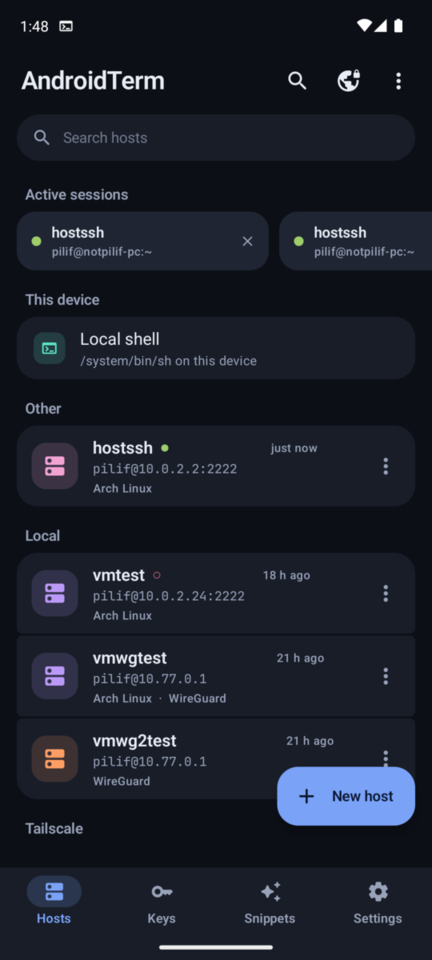
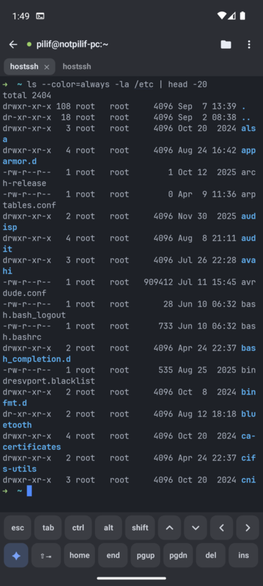
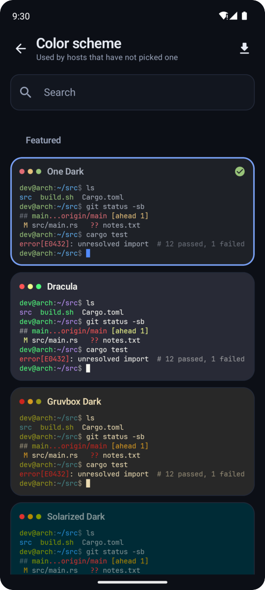
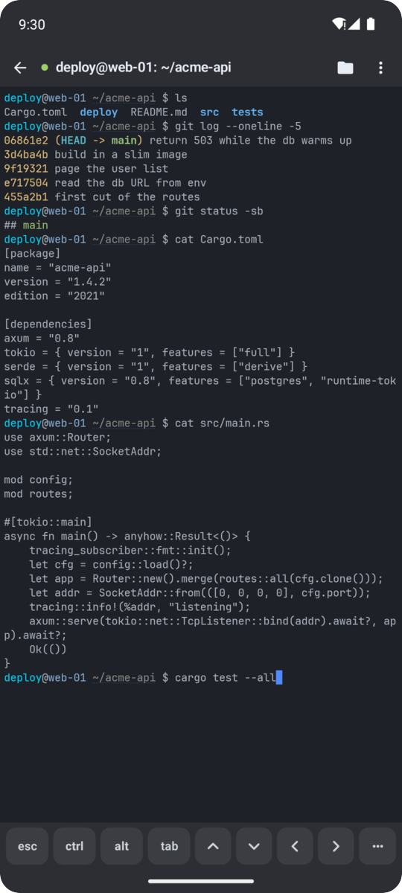
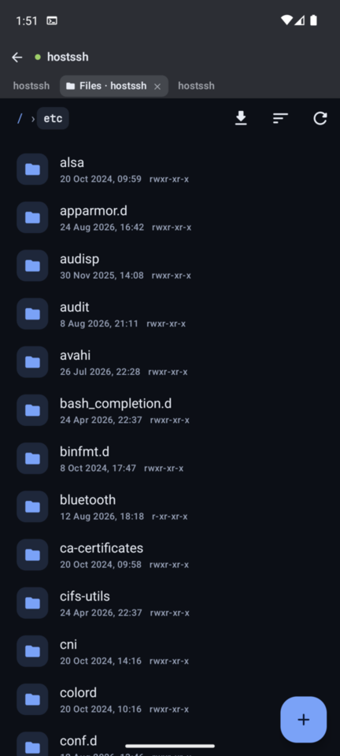
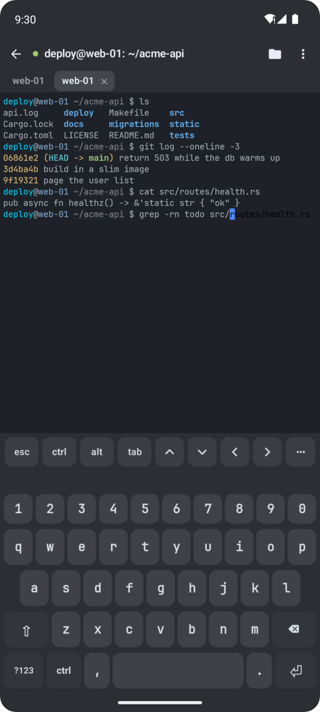

<h1 align="center">flintTerm</h1>

<p align="center">
  A fast SSH, SFTP and port-forwarding terminal for Android.
</p>

<p align="center">
  <a href="https://github.com/filipton/flintTerm/releases/latest"></a>
  
  
  
</p>

> **This project is vibecoded.**
>
> An AI wrote essentially all of the code here. I have not read most of it. I read the parts I
> decided mattered and left the rest alone.
>
> The technical decisions are mine. What the app does, which protocols and libraries it uses, how it
> behaves, what was worth building and what was not. I made those calls and drove the work. If
> something in here is a bad idea, it is my bad idea.

<table align="center">
  <tr>
    <td width="33%"></td>
    <td width="33%"></td>
    <td width="33%"></td>
  </tr>
  <tr>
    <td align="center"><sub>Hosts, grouped, each in its own color</sub></td>
    <td align="center"><sub>htop over SSH, full screen</sub></td>
    <td align="center"><sub>604 schemes, each a live preview</sub></td>
  </tr>
</table>

<details>
<summary align="center"><b>More: a shell, the file browser, the app's own keyboard</b></summary>
<br>
<table align="center">
  <tr>
    <td width="33%"></td>
    <td width="33%"></td>
    <td width="33%"></td>
  </tr>
  <tr>
    <td align="center"><sub>A session, with the extra-key bar</sub></td>
    <td align="center"><sub>SFTP, a tab of the same session</sub></td>
    <td align="center"><sub>The app's keyboard, Ctrl on the bottom row</sub></td>
  </tr>
</table>
</details>

## What it does

- **SSH** with keys, passwords, keyboard-interactive and OpenSSH certificates. Post-quantum key
  exchange is offered first.
- **Mosh**, written for this app rather than wrapped. Roaming and predictive echo, started over SSH,
  a jump host, WireGuard or a SOCKS5 proxy.
- **Keys** on the phone, in the Android Keystore, or on a FIDO2 security key over USB or NFC.
- **SFTP** as a tab of its own session, with background transfers and an editor for remote files.
- **Forwarding** both ways, jump-host chains, SOCKS and HTTP proxies, port knocking, Wake-on-LAN.
  Any host can act as a VPN for the whole phone.
- **WireGuard** and **Tailscale** built in, no root needed. Also telnet, USB serial and a local shell.
- A real **terminal**. Kitty keyboard protocol, inline images with kitty and sixel, OSC 8 links,
  OSC 52 clipboard, OSC 133 prompt marks, scrollback search, tmux control mode.
- **Typing that suits a terminal**: a customisable key bar, hold-Ctrl-and-slide chords, and an
  optional keyboard of the app's own with Ctrl where the emoji key was.
- **604 color schemes** with search. Import from Ghostty, Alacritty, Windows Terminal, iTerm2 and
  Xresources.
- Sessions **survive being backgrounded**, reopen after the app is killed, and can float in a small
  window over other apps.
- **Snippets**, a command palette, per-host history completion, session recording, app lock, and an
  encrypted backup of everything.
- Home-screen **widgets** for the host list and for one host's load, a quick-settings tile, launcher
  shortcuts, and an interface other apps can drive.

The long version is in [docs/features.md](docs/features.md).

## Install

Get an APK from [Releases](../../releases). Two files, either one works on any phone:

| file | terminal engine |
| --- | --- |
| `flintTerm-<version>.apk` | `alacritty_terminal` |
| `flintTerm-<version>-ghostty.apk` | libghostty-vt, measurably smoother on a busy TUI |

Both carry arm64 and x86_64. There is a separate `-armeabi-v7a` build for older 32-bit phones.

It is not on Google Play. Install the APK yourself and let Android ask about unknown sources.

## Build

```sh
./build-apk.sh                 # signed release, arm64-v8a -> dist/
./build-apk.sh --term ghostty  # the other engine, needs Zig 0.16+
./release.sh                   # everything a release page wants, both engines
```

You need the Android SDK with NDK 28+, Rust with `cargo-ndk`, and JDK 17+. Details, tests and how a
release is cut are in [docs/building.md](docs/building.md).

## How it is put together

- **Rust core** in `crates/`. SSH over [russh](https://github.com/Eugeny/russh) with `ring`, SFTP,
  forwarding, Mosh, userspace WireGuard, and terminal emulation behind a swappable `Emulator` trait.
- **Kotlin app** in `app/`. Jetpack Compose for the screens and a custom Canvas `TerminalView` for
  the grid, with no per-cell allocation on the draw path.
- **Bridge** via [uniffi](https://mozilla.github.io/uniffi-rs/), which generates the Kotlin bindings.
  The core runs on its own tokio runtime and hands the view a packed grid snapshot once per frame.

The VT engine is picked at compile time. The two are diffed against each other cell by cell, which
is covered in [docs/terminal-backend.md](docs/terminal-backend.md).

## More

- [Features in full](docs/features.md)
- [Backup and automation](docs/automation.md), driving a session from Tasker, a script or adb
- [Building, testing, releasing](docs/building.md)
- [Translating flintTerm](docs/translating.md), and how to send a language in
- [The terminal backend](docs/terminal-backend.md)
- [Changelog](CHANGELOG.md)

## License

MIT. See [LICENSE](LICENSE).

Third-party licenses are listed in the app under Settings, About, Licenses, and in [NOTICE](NOTICE).
